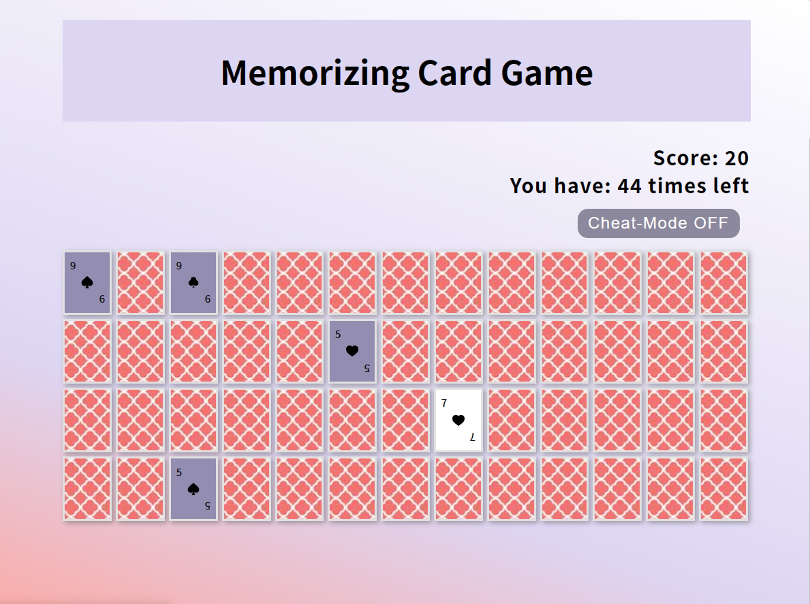
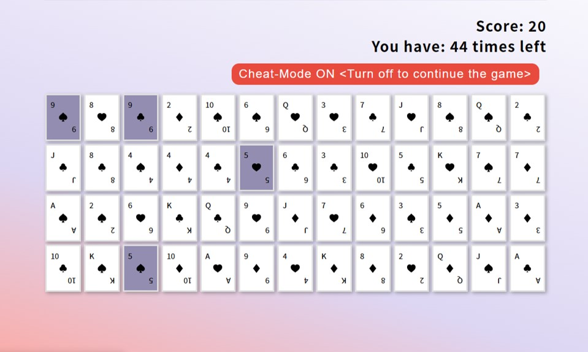
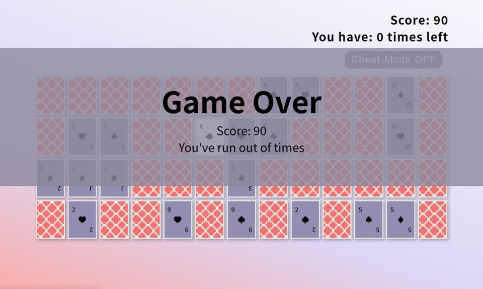
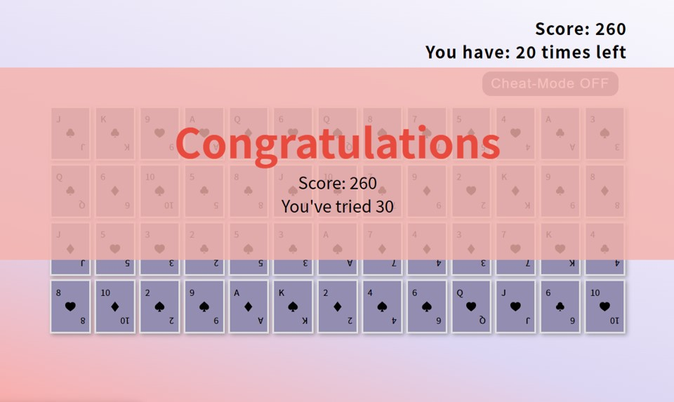

# Portfolio_Memorizing Card Game_upgrade version

## 介紹
  
Memorizing Card Game為卡片翻牌配對遊戲，共52張牌卡，26對牌組，翻出2張牌組數字相同即成功配對。配對成功則分數加10分，遊戲翻牌有次數限制，超過規定次數則遊戲失敗；次數內完成26對牌組配對，則遊戲成功。點擊Cheat-Mode按鈕，則開啟偷看模式，可看到未配對牌面內容；Cheat-Mode OFF(預設)則將未配對的卡牌蓋上，可繼續遊戲動作。
點擊連結瀏覽網站:https://sihping.github.io/Memorizing-Card-Game_upgrade-version/

### 功能

- 每回重新洗牌功能
- 點擊卡牌可完成翻牌功能
- 每回2張卡牌進行配對確認功能
- 分數計算功能
- 翻牌配對次數計算功能
- 偷看卡牌功能
- 遊戲失敗判斷功能
- 遊戲成功判斷功能

## 開發工具

- HTML
- CSS
- JavaScript